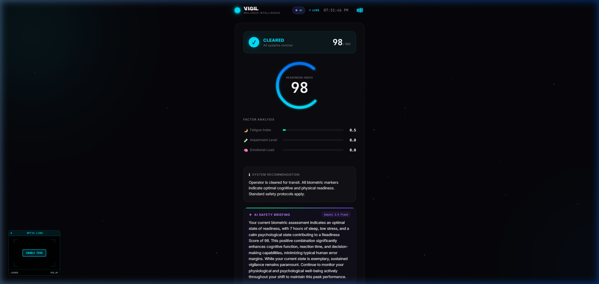

# VIGIL — Wellness Intelligence HMI
### Verify Impairment. Guard Innocent Lives.

> A premium, high-fidelity pre-drive wellness intelligence system targeting **UN SDG 3.6** — halving global road traffic deaths by 2030.

---

## 🚀 NEW: The Intelligence Evolution

VIGIL has evolved from a simple risk calculator into a clinical-grade AI Safety Briefing engine.

### 👁️ Optic Link (Retinal Scan)
A passive, real-time biometric HUD that establishes a secure "neural link" for operator monitoring. 
- **Privacy-First:** The camera feed is entirely local and optional.
- **High-Fidelity UI:** Features digital scanlines, contrasting filters, and a real-time crosshair tracking system for total immersion.

### 🧠 Gemini 2.5 Flash Safety Briefing
Integration with Google's most advanced multi-modal models to provide authoritative, evidence-based safety guidance.
- **Biometric Synthesis:** Analyzes the complex interplay between sleep, stress, and chemical load.
- **Clinical Prose:** Generates flowing, authoritative briefings that go beyond numbers to explain *how* your specific state compounds risk.

### 🔊 Audio Feedback Engine
- **Tactical Clicks:** Full Web Audio API synthesizer for tactile system feedback.
- **Voice synthesis:** Real-time clinical safety briefings delivered via the Web Speech API.

---

## 📸 Dashboard Preview



---

## The Solution

VIGIL is a compound biometric risk engine wrapped in a premium, luxury-grade Human-Machine Interface. It replaces the dangerous "I feel fine" with a non-negotiable **Readiness Score (0–100)**, forcing the operator to confront their objective impairment level before turning the ignition.

### How It Works

```
┌──────────────────────────────────────────────────────────┐
│  PHASE 1: BIOMETRIC CALIBRATION                         │
│                                                          │
│  Operator inputs four compound risk factors:             │
│  ┌──────────┐ ┌──────────┐ ┌──────────┐ ┌──────────┐   │
│  │  SLEEP   │ │  STRESS  │ │ EMOTION  │ │ CHEMICAL │   │
│  │ Duration │ │  Level   │ │  State   │ │Influence │   │
│  └────┬─────┘ └────┬─────┘ └────┬─────┘ └────┬─────┘   │
│       └──────┬─────┴──────┬─────┴──────┬──────┘         │
│              ▼            ▼            ▼                 │
│       ┌──────────────────────────────────────┐           │
│       │   COMPOUND RISK ENGINE (40/40/20)    │           │
│       │   Fatigue×0.4 + Impair×0.4 + Emo×0.2│           │
│       └──────────────────┬───────────────────┘           │
│                          ▼                               │
│  PHASE 2: AI SAFETY BRIEFING                             │
│  ┌────────────────────────────────────────────────┐      │
│  │         ╭─────────╮                            │      │
│  │         │  SCORE  │  → Authoritative AI        │      │
│  │         │   055   │     Safety Assessment      │      │
│  │         ╰─────────╯                            │      │
│  │  "VIGIL detects a critical combination..."     │      │
│  │  ⚠ Anomaly Chips (if risk detected)            │      │
│  └────────────────────────────────────────────────┘      │
└──────────────────────────────────────────────────────────┘
```

---

## Key Features

| Feature | Description |
|---|---|
| **AI Intelligence** | Secured proxy to Gemini 2.5 Flash for authoritative safety briefings. |
| **Optic Link HUD** | Live WebRTC-powered retinal scan interface with cinematic glitch filters. |
| **Compound Risk Engine** | Understands how sleep deficit multiplies the effects of stress and chemical influences. |
| **Anomaly Detection** | Dynamic warning chips slide in when specific thresholds are breached. |
| **Adaptive Theming** | UI shifts from Cyan → Amber → Crimson based on real-time risk calculations. |
| **Zero Dependencies** | 100% platform-native logic. No frameworks. No bloat. |

---

## Technical Stack

| Layer | Technology |
|---|---|
| **Frontend** | HTML5, CSS3 (Glassmorphism, Animations), Vanilla JS |
| **Backend** | Node.js, Express (Secure Proxy Architecture) |
| **AI Engine** | Google Gemini 2.5 Flash API |
| **Biometrics** | WebRTC (Video Feed), Web Audio API (Synthesizer), Web Speech API |

---

## How to Run Locally

1. **Clone & Install**
   ```bash
   git clone https://github.com/nika619/VIGIL.git
   npm install
   ```

2. **Configure API Key**
   Create a `.env` file in the root and add your Gemini API Key:
   ```env
   GEMINI_API_KEY=your_key_here
   ```

3. **Start the Engine**
   ```bash
   npm start
   ```
   Open `http://localhost:8080` to experience VIGIL.

---

## UN SDG Alignment — SDG 3.6
VIGIL directly targets the **human-error component** of road accidents by providing an objective, undeniable assessment of driver readiness — empowering operators to make safer decisions *before* the vehicle is in motion.

---

## Design Philosophy

> *"Premium means frictionless. If the UI bothers the user, it has failed."*

VIGIL is designed to feel like a native instrument panel in a luxury electric vehicle. The two-phase flow (Calibration → Assessment) ensures the operator is never overwhelmed, while the adaptive color theming and animated gauge provide immediate, intuitive feedback without requiring the user to read a single number.

---

<sub>⚠ VIGIL is a supplementary wellness indicator, not a medical or legal clearance device. The ultimate responsibility for safe vehicle operation rests solely with the operator.</sub>
