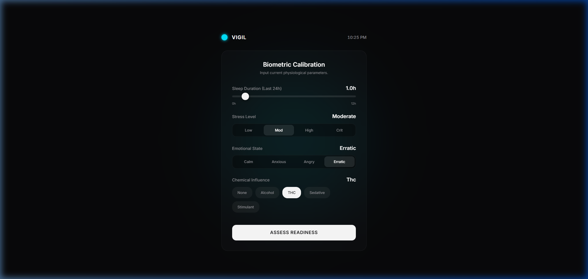
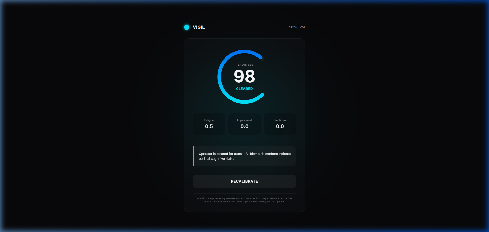
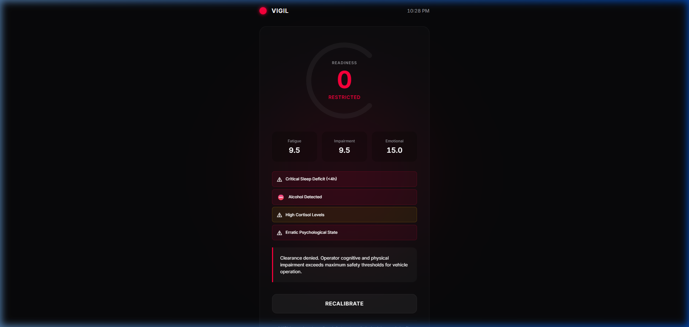

# VIGIL
### Verify Impairment. Guard Innocent Lives.

> A pre-drive wellness intelligence system targeting **UN SDG 3.6** — halving global road traffic deaths by 2030.

---

## The Problem

**1.35 million people die in road crashes every year.** A massive contributing factor is *subjective impairment* — drivers self-assessing that they are "fine to drive" when suffering from severe sleep deficits, acute stress, compounding emotional states, or residual chemical influences. 

Humans are notoriously bad at judging their own cognitive readiness. VIGIL exists to make that judgment objective.

---

## The Solution

VIGIL is a compound biometric risk engine wrapped in a premium, luxury-grade Human-Machine Interface. It replaces the dangerous "I feel fine" with a non-negotiable **Readiness Score (0–100)**, forcing the operator to confront their objective impairment level before turning the ignition.

### How It Works

```
┌──────────────────────────────────────────────────────────┐
│  PHASE 1: BIOMETRIC CALIBRATION                         │
│                                                          │
│  Operator inputs four compound risk factors:             │
│  ┌──────────┐ ┌──────────┐ ┌──────────┐ ┌──────────┐   │
│  │  SLEEP   │ │  STRESS  │ │ EMOTION  │ │ CHEMICAL │   │
│  │ Duration │ │  Level   │ │  State   │ │Influence │   │
│  └────┬─────┘ └────┬─────┘ └────┬─────┘ └────┬─────┘   │
│       └──────┬─────┴──────┬─────┴──────┬──────┘         │
│              ▼            ▼            ▼                 │
│       ┌──────────────────────────────────────┐           │
│       │   COMPOUND RISK ENGINE (40/40/20)    │           │
│       │   Fatigue×0.4 + Impair×0.4 + Emo×0.2│           │
│       └──────────────────┬───────────────────┘           │
│                          ▼                               │
│  PHASE 2: CLEARANCE STATUS                               │
│  ┌────────────────────────────────────────────────┐      │
│  │         ╭─────────╮                            │      │
│  │         │  SCORE  │  → CLEARED / CAUTION /     │      │
│  │         │   078   │     RESTRICTED              │      │
│  │         ╰─────────╯                            │      │
│  │  [Fatigue: 2.1] [Impair: 0.0] [Emotion: 1.5]  │      │
│  │  ⚠ Anomaly Chips (if risk detected)            │      │
│  │  📋 Contextual Recommendation                  │      │
│  │  ⚖️ Liability Disclaimer                       │      │
│  └────────────────────────────────────────────────┘      │
└──────────────────────────────────────────────────────────┘
```

---

## Screenshots

### Phase 1 — Biometric Calibration
*Clean, frictionless input with luxury EV aesthetics.*



### Phase 2 — Cleared
*Optimal cognitive state. Cyan theme. Zero anomalies.*



### Phase 2 — Restricted
*Compound impairment detected. Crimson theme. Anomaly chips active.*



---

## Key Features

| Feature | Description |
|---|---|
| **Compound Risk Engine** | Doesn't look at factors in isolation. Understands how sleep deficit multiplies the effects of stress and chemical influences. |
| **Anomaly Detection** | Dynamic warning chips slide in when specific thresholds are breached (e.g., `⛔ Alcohol Detected`, `⚠ Critical Sleep Deficit`). |
| **Analysis Theater** | A 1.2s dramatic processing pause before results, giving the assessment psychological weight. |
| **Adaptive Theming** | The entire UI — gauge, ambient glow, logo indicator — shifts from Cyan → Amber → Crimson based on risk. |
| **Liability Disclaimer** | Every assessment carries a visible legal disclaimer, ensuring real-world feasibility. |
| **Zero Dependencies** | 100% platform-native HTML/CSS/JS. No frameworks, no build tools, no CDN calls. |

---

## Technical Stack

| Layer | Technology |
|---|---|
| Structure | HTML5 (Semantic) |
| Styling | CSS3 (Custom Properties, Glassmorphism, Keyframe Animations) |
| Logic | Vanilla JavaScript (IIFE, State Machine, SVG Path Animation) |
| Typography | Inter (Google Fonts) |
| Frameworks | **None.** Zero external dependencies. |

---

## How to Run

```bash
# Clone
git clone https://github.com/YOUR_USERNAME/vigil.git

# Open in any modern browser
open index.html
```

No installation. No build step. No server required.

---

## UN SDG Alignment

### SDG 3 — Good Health & Well-Being
**Target 3.6:** *By 2030, halve the number of global deaths and injuries from road traffic accidents.*

VIGIL directly targets the **human-error component** of road accidents by providing an objective, undeniable assessment of driver readiness — empowering operators to make safer decisions *before* the vehicle is in motion.

---

## Design Philosophy

> *"Premium means frictionless. If the UI bothers the user, it has failed."*

VIGIL is designed to feel like a native instrument panel in a luxury electric vehicle. The two-phase flow (Calibration → Assessment) ensures the operator is never overwhelmed, while the adaptive color theming and animated gauge provide immediate, intuitive feedback without requiring the user to read a single number.

---

<sub>⚠ VIGIL is a supplementary wellness indicator, not a medical or legal clearance device. The ultimate responsibility for safe vehicle operation rests solely with the operator.</sub>
